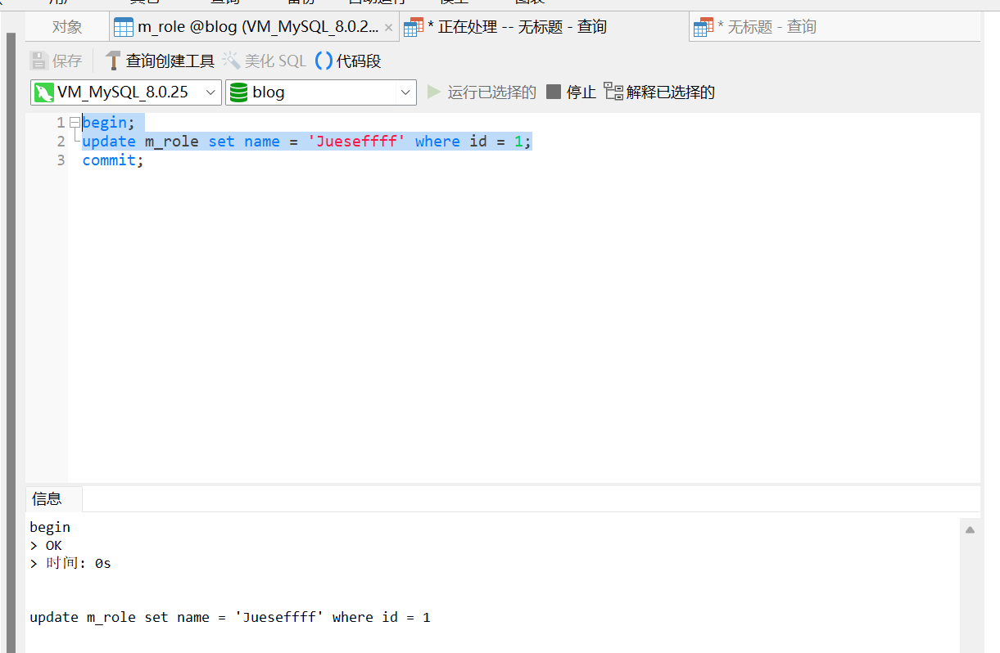

## 一、Lock与Latch

在数据库系统中，"Lock" 和 "Latch" 是两种不同的概念，虽然它们都用于处理并发访问，但用途和实现方式有所不同。下面是它们的区别：

### Latch（门锁）
Latch 一般称为门锁，是一种用于实现并发控制的轻量级同步原语。它的作用是在多个线程之间保护共享资源，以防止出现竞争条件。Latch 的特点是需要锁定的时间非常短，通常用来保护临界区，如内存数据结构的修改。

- **性能：** Latch 要求持续锁定的时间非常短，因为它是一种基本的同步机制，过长的持锁时间会降低系统性能。
- **实现：** 在 InnoDB 存储引擎中，Latch 可以分为两种类型：
  - **Mutex（互斥量）：** 用于保护共享资源，一次只允许一个线程访问临界区。
  - **RWLock（读写锁）：** 用于读写分离场景，允许多个线程同时读取共享资源，但只允许一个线程写入，写入时不允许其他线程读取。

- **释放时间：** Latch 通常在临界区访问结束后立即释放，以允许其他线程进入。不同的线程隔离级别可能会影响 Latch 的释放时间。

- **死锁检测：** Latch 一般没有死锁检测机制，因为它的作用范围是局部的，对于持续时间较短的临界区。

### Lock（锁）
Lock 是用于事务控制的机制，它用来锁定数据库中的对象，如表、页、行等。它的目的是保证事务在读取和修改数据时的一致性和正确性。

- **对象：** Lock 的对象是事务，用来锁定的是数据库中的对象，如表、页、行等。
- **持续时间：** Lock 的对象在事务提交（commit）或回滚（rollback）后释放，不同的事务隔离级别可能会影响 Lock 的持续时间。
- **死锁机制：** Lock 通常具有死锁检测机制，以防止事务之间发生死锁情况。

### 总结
- **Latch（门锁）：** 轻量级的同步原语，用于保护临界资源，要求持续锁定时间非常短，通常没有死锁检测机制。
- **Lock（锁）：** 用于事务控制，锁定数据库中的对象，保证事务的一致性和正确性，根据事务的提交或回滚释放，通常具有死锁检测机制。

下表列出了 Lock 和 Latch 的一些不同之处：

| 特征         | Lock（锁）                     | Latch（门锁）                          |
| ------------ | ------------------------------ | -------------------------------------- |
| 作用对象     | 数据库中的对象（表、页、行等） | 临界资源（内存数据结构等）             |
| 持续时间     | 事务提交或回滚后释放           | 临界区访问结束后释放                   |
| 死锁检测     | 通常具有死锁检测机制           | 通常没有死锁检测机制                   |
| 用途         | 事务控制，保证一致性和正确性   | 并发控制，防止竞争条件                 |
| 实现方式     | 涉及数据库操作，较重量级       | 轻量级同步原语，用于保护内存数据结构等 |
| 释放时间     | 事务提交或回滚后释放           | 临界区访问结束后释放                   |
| 处理竞争条件 | 处理事务之间的竞争条件         | 处理多线程访问临界资源的竞争条件       |

这些概念在数据库系统的并发控制中起着重要的作用，了解它们的差异有助于设计和优化数据库应用。

当我们谈论并发控制时，可以通过一个通俗的例子来解释 Lock（锁）和 Latch（门锁）的区别。

### 例子：图书馆的书籍管理

#### Lock（锁）

想象一个图书馆，有很多学生想要借阅同一本书，图书管理员需要确保每本书在同一时间只能由一个学生借阅，以防止出现错误或冲突。

- **Lock 的作用：** 这里的“Lock” 就像是图书管理员在办理借书手续时锁定了这本书，只有办理完毕（即事务提交）或取消借阅（即事务回滚）后才能再次借阅。在这个过程中，这本书就是被“锁定”了。

- **持续时间：** 当学生完成借书手续并离开图书馆时（即事务提交），这本书的“Lock”就被释放了。如果学生在办理借书手续过程中放弃了借书（即事务回滚），这本书的“Lock”也会被释放。

- **死锁检测：** 图书管理员可以监控是否有学生在借书时卡住了，如果出现了某个学生拿着一本书等着另外一本书被归还的情况（即死锁），图书管理员可以介入解决。

#### Latch（门锁）

现在想象图书馆里的一个独立的学习空间，里面有很多学生想要同时进入，但空间有限，只能容纳一定数量的人。

- **Latch 的作用：** 在这个场景中，“Latch” 就像是进入学习空间的门锁。学生进入学习空间时，他们需要先检查门上的“Latch”状态。如果“Latch”是打开的，他们可以顺利进入；如果“Latch”是关闭的，他们需要等待，直到有人离开并打开了门。

- **持续时间：** 学生进入学习空间后，他们会关闭门，这时候“Latch”也会变为关闭状态。只有当他们完成学习并离开学习空间后，才会再次打开门，使得其他学生可以进入。

- **死锁检测：** 由于这是一个独立的空间，通常不会发生死锁情况。但是如果出现某个学生进入后一直不愿意离开，或者门坏了无法打开，这可能导致其他学生无法进入，这时候需要人工干预来解决。

#### 对比解释

- **Lock（锁）：**
  - 在借书时，图书管理员锁定了每本书，保证了一本书只能被一个学生借阅。
  - 锁定的时间是从办理借书手续到还书手续结束的过程。
  - 图书管理员会监控是否有学生卡住了借书流程，及时解决可能的死锁情况。

- **Latch（门锁）：**
  - 在进入学习空间时，学生需要检查门上的“Latch”状态，如果是关闭的就等待，直到有人打开门。
  - 进入空间后，学生关闭门，将“Latch”变为关闭状态，其他学生需要等待。
  - 当学生离开后，再次打开门，允许其他学生进入。

这个例子比较直观地解释了 Lock 和 Latch 的区别。Lock（锁）更关注于事务的控制和资源的保护，而 Latch（门锁）更像是一种同步原语，用于控制多个线程或进程对共享资源


在 InnoDB 存储引擎中，实现了两种标准的行级锁：共享锁（SLock）和排他锁（XLock）。这些锁的作用是保证事务在对数据行进行读取、删除或更新时的并发操作正确性。


## 二、InnoDB存储引擎中的锁


### 共享锁（SLock）：
- 允许事务读取一行数据，并且多个事务可以同时持有相同行的共享锁。
- 如果一个事务 T1 已经获得了行 r 的共享锁，那么其他事务 T2 可以立即获得行 r 的共享锁，因为读取操作不会改变行 r 的数据。
- 共享锁允许多个事务同时读取同一行数据，这种情况称为锁兼容（Lock Compatible）。

### 排他锁（XLock）：
- 允许事务删除或更新一行数据，但不允许其他事务同时持有相同行的共享锁或排他锁。
- 如果一个事务 T1 已经获得了行 r 的共享锁，那么另一个事务 T3 想要获得行 r 的排他锁，则必须等待事务 T1 释放行 r 的共享锁。
- 排他锁不兼容于共享锁和其他排他锁，一个事务获得了行 r 的排他锁后，其他事务无法再获得行 r 的任何类型的锁。

下表显示了共享锁和排他锁之间的兼容性：

| 锁类型          | 共享锁（SLock）                          | 排他锁（XLock）                        |
| --------------- | ---------------------------------------- | -------------------------------------- |
| 共享锁（SLock） | 兼容，多个事务可以同时持有同一行的共享锁 | 不兼容，其他事务无法获得同一行的任何锁 |
| 排他锁（XLock） | 不兼容，其他事务无法获得同一行的任何锁   | 不兼容，其他事务无法获得同一行的任何锁 |

这种锁的设计和兼容性规则确保了数据的一致性和事务的正确执行。例如，**当一个事务需要更新一行数据时，它会获取这一行的排他锁，这样其他事务就无法同时读取或更新这一行数据，从而避免了数据不一致的情况**。

这些行级锁是 InnoDB 存储引擎实现事务隔离级别的基础，不同的事务隔离级别会影响行级锁的获取和释放时机，从而影响到并发性和数据一致性。在设计数据库应用程序时，需要根据实际需求选择合适的事务隔离级别以及合理使用行级锁来确保数据的正确性和并发操作的效率。

### 例子

- 开启一个事务，执行update，未提交


- 第二个事务被阻塞了，因此第一个视图在执行update时，获取了该条记录的排他锁，当前事务必须等待第一个事务提交或者回滚时，才能获取该条记录的排他锁执行update语句。

  


### 意向锁

概念：数据库锁的粒度分为表锁、页锁、行锁。 假设事务A需要对r记录上排他锁，那么需要对页、表上一个意向排他锁,说白了就是一种表锁。

作用：提高并发性能、降低死锁风险。

兼容性：

|      | IS-意向共享锁 | IX-意向排他锁 | S-共享锁 | X-排他锁 |
| ---- | ------------- | ------------- | -------- | -------- |
| IS   | 兼容          | 兼容          | 兼容     | 不兼容   |
| IX   | 兼容          | 兼容          | 不兼容   | 不兼容   |
| S    | 兼容          | 不兼容        | 兼容     | 不兼容   |
| X    | 不兼容        | 不兼容        | 不兼容   | 不兼容   |

示例：

表t数据

id   name   

1	记录1	
		2	记录2


| 时间 | 事务A                                                        | 事务B                                                        |
| :--- | :----------------------------------------------------------- | ------------------------------------------------------------ |
| 1    | begin;<br />SELECT * FROM `m_role` <br />where id= 1 for update;<br />-- 获取id=1的排他锁，会获取页、表的意向排他锁 |                                                              |
| 2    |                                                              | begin;<br/>SELECT * FROM `m_role` <br />where id = 2 lock in share mode;<br />-- 获取id=2的共享锁，会获取页、表的意向共享锁（意向排他锁和意向共享锁兼容） |
|      |                                                              |                                                              |

### 锁升级

假设表t的name字段没有索引

| 时间 | 事务A                                                        | 事务B                                                        |
| :--- | :----------------------------------------------------------- | ------------------------------------------------------------ |
| 1    | begin;<br />SELECT * FROM `t` <br />where name= '记录1' for update;<br />-- 获取name='记录1'的排他锁，由于name没有索引，导致锁升级，直接获取了表t的排他锁 |                                                              |
| 2    |                                                              | begin;<br/>SELECT * FROM `m_role` <br />where name= '记录2' lock in share mode;<br />-- 这时事务B获取了不到记录2的共享锁，因为表t已经有一个排他锁了。 |


## 三、锁是如何实现隔离性的

### 读未提交

不加锁,会出现脏读

### 读已提交

#### 设置隔离级别

```sql
SET SESSION TRANSACTION ISOLATION LEVEL READ COMMITTED;
```

| 时间 | 事务A                                                        | 事务B                                                   |
| :--- | :----------------------------------------------------------- | ------------------------------------------------------- |
| 1    |                                                              | begin;<br/>SELECT * FROM `m_role` where id = 1;         |
| 2    | begin;<br/>update m_role set name = 'fsf32131sd' where id = 1; |                                                         |
| 3    |                                                              | SELECT * FROM `m_role` where id = 1 lock in share mode; |

在第三步这里事务B获取共享锁阻塞住了，说明事务A加了排他锁。当事务A提交后，会唤醒事务B，此时的查询结果是修改后的值，也就是出现了两次数据不一致，既不可重复读。

